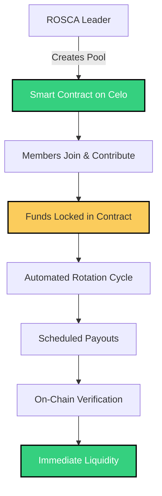

<div align="center">


# Cult Finance

### Bringing Community Savings (ROSCAs) On-Chain with Celo

[](https://github.com/cadalt0/cult-finance)
[](https://github.com/cadalt0/cult-finance/issues)
[](https://celo.org)
[](https://opensource.org/licenses/MIT)

[Features](#features) • [Getting Started](#getting-started) • [Architecture](#architecture) • [Documentation](#documentation) • [Contributing](#contributing)

</div>

---

## Overview

Cult Finance is a decentralized platform that brings traditional Rotating Savings and Credit Associations (ROSCAs) onto the Celo blockchain. We provide ROSCA leaders, communities, and startups with the tools to run transparent, secure, and trustless savings pools, making community-driven finance scalable and verifiable for everyone.

### What We Enable

**For Market Vendors and Local Communities**  
Community members can pool their resources together without worrying about fraud, mismanagement, or broken trust. Every contribution and payout is recorded on the blockchain, creating an immutable record that protects all participants.

**For Startups and Small Businesses**  
Access immediate liquidity from trusted circles and communities without navigating traditional venture capital or banking gatekeepers. Smart contracts ensure fair distribution and automated payouts.

**For Underserved Populations**  
Financial inclusion for billions of people who lack access to traditional banking infrastructure. By leveraging Celo's mobile-first approach, we make decentralized finance accessible to anyone with a smartphone.

### The Problem We Solve

Traditional ROSCAs, while powerful tools for community savings, face several critical challenges:

- **Opacity** - Members must place complete trust in organizers without visibility into fund management
- **Risk of Fraud** - No guarantees exist for fund security or proper rotation schedules
- **Limited Scale** - Coordinating large groups becomes increasingly difficult
- **Dispute Resolution** - Without verifiable records, conflicts are nearly impossible to resolve fairly

Cult Finance addresses these issues by leveraging blockchain technology to create transparent, automated, and trustless savings pools that anyone can verify and participate in.

---

## Features

### On-Chain ROSCAs
Traditional savings circles powered by tamper-proof smart contracts that execute automatically. No more manual tracking or trust issues.

### Complete Transparency
Every transaction is permanently recorded on the Celo blockchain. Members can verify contributions, payouts, and the complete history of their savings pool at any time.

### Automated Operations
Smart contracts handle all the complex logistics automatically - from collecting contributions to distributing payouts on schedule. No human intervention means no human error.

### Instant Liquidity Access
Participants receive their funds exactly when scheduled, with mathematical precision. Communities and startups can rely on predictable cash flow.

### Security First
Audited smart contracts ensure that funds are protected and distributed fairly according to the rules agreed upon by all members.

### Mobile Accessible
Built on Celo's mobile-first blockchain, making it easy for anyone with a smartphone to participate in decentralized savings pools.

---

## Architecture

### System Overview



---

## Getting Started

### Prerequisites

Before you begin, ensure you have the following installed:

- Node.js version 18 or higher
- npm or yarn package manager
- A Celo wallet (Valora, MetaMask with Celo network, or Celo Wallet)
- Basic understanding of blockchain and smart contracts

### Installation

Clone the repository and install dependencies:

```bash
git clone https://github.com/cadalt0/cult-finance.git
cd cult-finance
npm install
```

### Local Development

Start a local development environment:

```bash
# Start a local Celo node
npm run node

# In a new terminal, deploy contracts locally
npm run deploy:local

# Start the frontend development server
npm run dev
```

The application will be available at `http://localhost:3000`

### Testing

Run the test suite to ensure everything works correctly:

```bash
# Run all tests
npm test

# Run tests with coverage
npm run test:coverage

# Run specific test file
npm test test/ROSCA.test.ts
```

### Deploying to Celo Testnet

To deploy on the Alfajores testnet:

```bash
# Copy environment template
cp .env.example .env

# Edit .env with your configuration:
# - Add your private key
# - Add Celo Alfajores RPC URL
# - Configure other parameters

# Deploy to testnet
npm run deploy:testnet

# Verify contracts on CeloScan
npm run verify:testnet
```

### Deploying to Celo Mainnet

For production deployment:

```bash
# Ensure your .env is configured for mainnet
npm run deploy:mainnet

# Verify contracts
npm run verify:mainnet
```

**Important**: Make sure you have sufficient CELO tokens for gas fees before deploying to mainnet.

---

## Usage

### Creating a ROSCA

As a ROSCA leader, you can create a new savings pool:

```javascript
import { ROSCAFactory } from './contracts';

// Create a new ROSCA
const rosca = await ROSCAFactory.createROSCA({
  contributionAmount: ethers.parseEther("10"), // 10 CELO per member
  cycleDuration: 30 * 24 * 60 * 60, // 30 days in seconds
  maxMembers: 10,
  startTime: Math.floor(Date.now() / 1000) + (7 * 24 * 60 * 60) // Starts in 7 days
});

console.log(`ROSCA created at address: ${rosca.address}`);
```

### Joining an Existing ROSCA

Members can join a ROSCA by making their initial contribution:

```javascript
// Connect to existing ROSCA
const rosca = await ethers.getContractAt("ROSCA", roscaAddress);

// Join and contribute
await rosca.join({ 
  value: ethers.parseEther("10") 
});

console.log("Successfully joined ROSCA");
```

### Checking ROSCA Status

Query the current state of your ROSCA:

```javascript
// Get ROSCA details
const details = await rosca.getDetails();

console.log(`Members: ${details.memberCount}/${details.maxMembers}`);
console.log(`Current cycle: ${details.currentCycle}`);
console.log(`Next payout: ${new Date(details.nextPayoutTime * 1000)}`);
```

### Automated Payouts

The smart contract automatically handles payouts according to the rotation schedule. No manual intervention is needed. Each cycle, the designated member receives the pooled funds automatically.

---

## Smart Contract Design

### ROSCA Contract

The core ROSCA contract implements the following key functionality:

**Initialization**
- Set contribution amount per member
- Define cycle duration and maximum members
- Establish start time and rotation order

**Member Management**
- Allow new members to join before start
- Track member contributions and payout status
- Maintain rotation queue

**Contribution Tracking**
- Enforce contribution requirements each cycle
- Handle late or missed contributions
- Calculate and distribute penalties if configured

**Payout Logic**
- Automatically determine current cycle recipient
- Execute transfers at the end of each cycle
- Update rotation queue for next cycle

**Security Features**
- Reentrancy protection on all external calls
- Access control for administrative functions
- Emergency pause functionality

### ROSCAFactory Contract

The factory contract enables:
- Standardized ROSCA deployment
- Parameter validation
- Registry of all created ROSCAs
- Upgrade path for future improvements

---

## Security

Security is our top priority. We implement multiple layers of protection:

**Smart Contract Security**
- Comprehensive test coverage (>95%)
- External security audits (planned)
- Formal verification of critical functions
- Time-tested OpenZeppelin libraries

**Best Practices**
- Checks-Effects-Interactions pattern
- Reentrancy guards on all payable functions
- Access control with role-based permissions
- Emergency circuit breakers

**Audit Status**
- Internal security review: Complete
- External audit: Scheduled for Q1 2025
- Bug bounty program: Coming soon

---

## Roadmap

### Phase 1: Foundation (Current)
- Core ROSCA smart contracts
- Basic web interface
- Testnet deployment
- Community feedback collection

### Phase 2: Enhancement
- Advanced ROSCA features (flexible contributions, early exit options)
- Mobile application development
- Integration with Celo's MiniPay
- Multi-token support

### Phase 3: Growth
- DAO governance implementation
- Community voting on ROSCA parameters
- Partnership programs with local organizations
- Educational resources and tutorials

### Phase 4: Scale
- Cross-chain expansion
- Enterprise features for larger communities
- Advanced analytics dashboard
- API for third-party integrations

---

## Contributing

We welcome contributions from developers, designers, community organizers, and anyone passionate about financial inclusion. Here's how you can help:

### Code Contributions

1. Fork the repository
2. Create a feature branch (`git checkout -b feature/amazing-feature`)
3. Commit your changes (`git commit -m 'Add amazing feature'`)
4. Push to your branch (`git push origin feature/amazing-feature`)
5. Open a Pull Request

### Reporting Bugs

Found a bug? Please open an issue with:
- Clear description of the problem
- Steps to reproduce
- Expected vs actual behavior
- Screenshots if applicable

### Feature Requests

Have an idea? We'd love to hear it. Open an issue describing:
- The problem you're trying to solve
- Your proposed solution
- Why this would benefit the community

### Documentation

Help us improve documentation by:
- Fixing typos or unclear explanations
- Adding examples and tutorials
- Translating documentation to other languages

---

## Community

Join our growing community of builders and users:

- **Discord**: Join discussions and get help from the team
- **Twitter**: Follow us for updates and announcements
- **GitHub Discussions**: Share ideas and feedback
- **Documentation**: Comprehensive guides (coming soon)

---

## License

This project is licensed under the MIT License. See the [LICENSE](LICENSE) file for details.

---

## Acknowledgments

Built with support from the Celo ecosystem and inspired by traditional community savings models used by millions worldwide. Special thanks to all contributors and community members who believe in making finance more inclusive and transparent.

---

<div align="center">

**Made with care on the Celo blockchain**

[GitHub](https://github.com/cadalt0/cult-finance) • [Documentation](#) • [Community](#)

</div>
